# MReader

MReader 是一个面向 iPhone 与 iPad 的漫画阅读 App。它的目标不是做一个简单的图片浏览器，而是把“本地漫画库、远程媒体库、长条漫画阅读、OCR 放大、AI 翻译、封面书架、阅读进度、触感反馈”这些日常阅读漫画时真正会用到的能力整合在一起。第一版重点解决三个问题：漫画文件必须可由用户自己管理；阅读器必须适合普通漫画与长条漫画；AI 功能不能打断阅读。

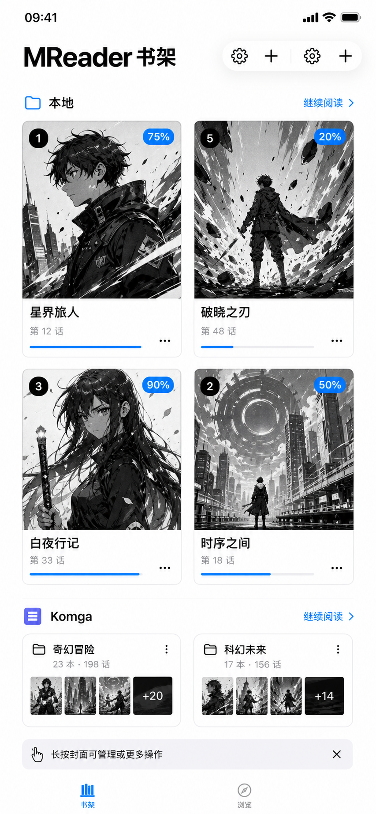

## 设计目标

MReader 的本地库以 iOS 文件 App 中用户选择的目录为唯一漫画根目录。也就是说，漫画源文件不会被偷偷复制到 App 沙盒里，用户可以直接在“文件 App / 在我的 iPhone 上 / Manga”或 iCloud Drive 中管理漫画。App 只保存数据库、阅读进度、缩略图缓存、OCR 缓存和必要设置。这样的设计可以避免常见问题：漫画导入后路径打不开、删不掉、备份困难、换 App 后不知道文件在哪里。

第二个目标是阅读体验。漫画有很多形态：单页图片、双页扫描、PDF、长条 Webtoon、ZIP/CBZ 压缩包、文件夹章节、系列目录。MReader 将这些内容统一成书架条目和阅读页，不要求用户改变自己的目录习惯。普通漫画可以水平翻页，长条漫画可以连续滚动或无限滚动，iPad 可以使用双页模式。每本漫画都有独立阅读设置，重新打开时恢复上次的方向、模式、动画、适配方式和进度。

第三个目标是把 AI 做成辅助，而不是遮挡内容的干扰项。OCR 放大和 AI 翻译都可以针对单本漫画开启或关闭；AI 翻译按钮放在阅读器角落，长按漫画页也可以触发翻译；翻译过程中有边缘流光反馈；翻译文本按 OCR 句子位置显示，并尽量避让重叠。用户可以调节 OCR 安全区和忽略小字阈值，避免网址、水印、广告小字被错误处理。

## 书架

MReader 的书架不是单纯列表，而是一个带封面、进度、来源标记和系列层级的漫画管理界面。书架支持两栏网格显示，每个漫画卡片使用固定封面框，封面不会因为原图宽高不同而撑破布局。标题、页数、大小、进度条和来源标签统一对齐，点击区域被限制在当前卡片内，避免透明区域覆盖相邻卡片造成误点。

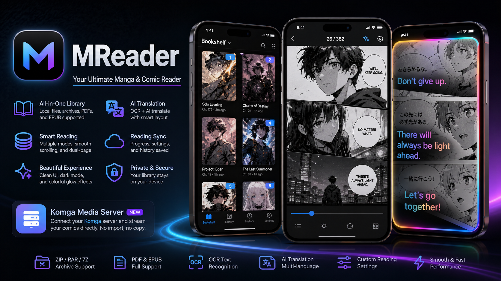

本地库扫描会识别根目录下的漫画压缩包、PDF、EPUB、图片文件夹和系列文件夹。系列目录作为书架二级结构显示，打开后可以看到其中的章节漫画。长按漫画或系列可以进入管理操作，例如删除、重命名、重建缩略图、分享、在文件中打开、锁定等。选择模式下，漫画与系列都可以参与批量操作，删除会作用于用户可见本地库中的真实文件或文件夹，并在执行前进行确认。

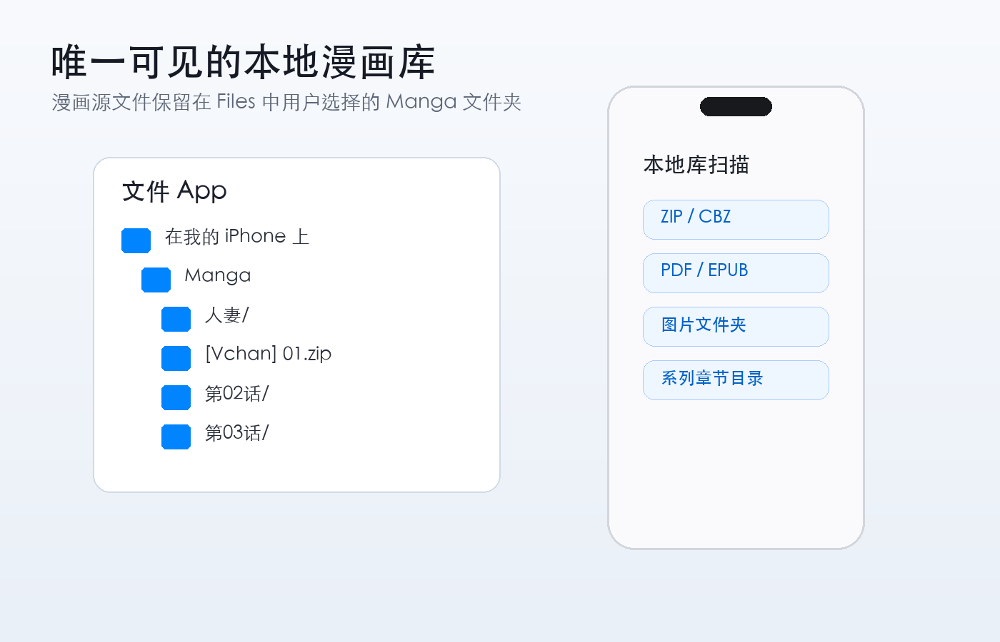

书架支持下拉刷新。用户在“立即阅读”、书架网格、书架列表或空书架状态下向下拉动，都可以触发刷新。本地库会重新扫描用户选择的 Files 漫画根目录；Komga 媒体库会重新请求服务端 API。如果 Komga 源失去连接，该源下的远程漫画会从书架中移除，避免显示不可打开的失效条目。

## 立即阅读

“立即阅读”和“书架”是两个独立页面，通过顶部导航栏切换。立即阅读不是简单复制书架，而是按照 `lastReadAt` 最近阅读时间排序，最新看过的漫画排在最上方。卡片展示封面、标题、阅读进度和页数，适合快速回到上次中断的位置。

阅读进度不仅仅保存水平翻页模式。连续滚动、无限滚动、垂直翻页和双页模式都会通过统一入口写回 `ComicBook.currentPageIndex`、`scrollProgress`、`scrollPageProgress` 和 `lastReadAt`。滚动模式通过页面几何位置识别当前屏幕中心附近的页码，并做节流保存；退出阅读器和 App 进入后台时会立即保存最终位置。

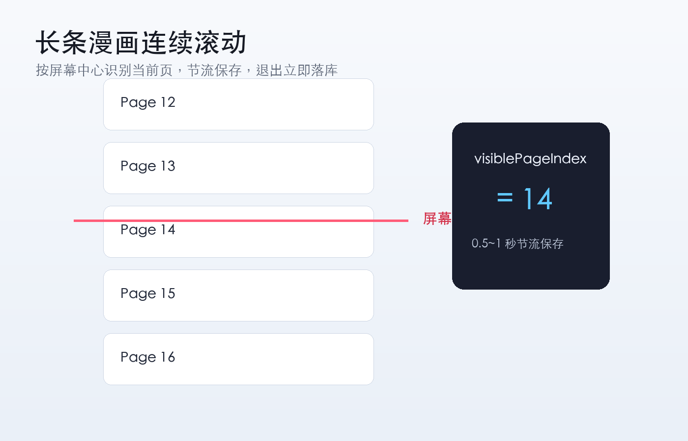

## 阅读器

阅读器默认进入沉浸式阅读状态，工具栏隐藏。单击屏幕显示顶部工具栏，再次单击或数秒无操作后自动隐藏。顶部工具栏包含返回、当前页码、AI 按钮和设置按钮，不覆盖漫画内容区域。AI 翻译按钮也保留在右下角，便于单手触发，但不会像大按钮一样长期挡住页面。

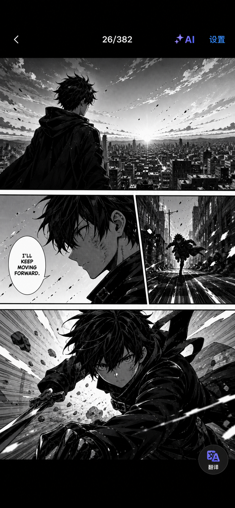

阅读器支持多种模式：水平翻页、垂直翻页、连续滚动、无限滚动和双页模式。翻页动画与阅读模式分离，可以选择无动画、滑动、淡入淡出和卷曲。默认阅读方向为左到右；用户也可以针对每本漫画改成右到左。iPhone 默认单页，iPad 可用双页模式。

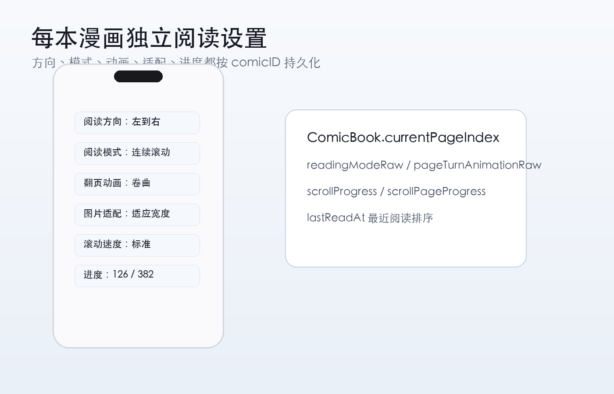

长条漫画滚动体验做了专门处理。连续滚动模式下，点击翻页不会一次跳过太多内容，单次滚动距离受到限制；拖拽手势有阈值，轻微滑动不会误触翻页；无限滚动不会因为下一页图片加载完成而突然改变 offset。未加载页面会预留高度，避免快速滑动时一个屏幕出现大量加载符并导致页码突然跳变。

## 本地库与格式支持

MReader 的本地库扫描逻辑遵循用户已有目录结构，不会擅自把漫画重新拆分成其他层级。根目录下可以同时存在压缩包漫画和文件夹漫画；系列文件夹内也可以混合 ZIP 章节、图片文件夹章节、PDF 或 EPUB。扫描时不会因为目录中存在子文件夹就跳过同级压缩包。

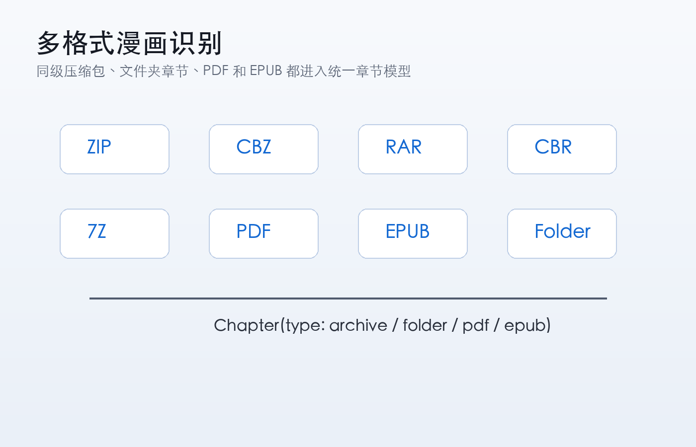

ZIP/CBZ 读取采用递归扫描，支持压缩包里包一层或多层目录的结构，例如 `manga.zip/001.jpg`、`manga.zip/漫画名/001.jpg`、`manga.zip/漫画名/第01话/001.jpg`。图片扩展名大小写会统一处理，`__MACOSX`、`.DS_Store`、`Thumbs.db` 和隐藏文件会被过滤。图片条目使用自然排序，避免 `10.jpg` 排在 `2.jpg` 前面。读取时不会一次性把整个 ZIP 解压到内存，而是列出图片条目，在阅读时按需读取当前页。

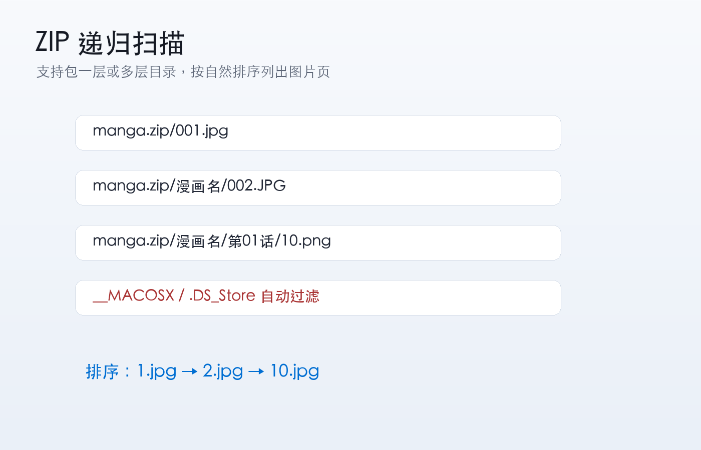

PDF 漫画会按页渲染，长条 PDF 在滚动模式下保存真实阅读位置。EPUB 已作为第一版支持格式接入，适合作为图片型 EPUB 漫画入口。第一版稳定导入格式聚焦 ZIP、CBZ、EPUB、PDF 和图片文件夹；7z、RAR、CBR 暂不开放入口，避免出现“可选择但底层不可用”的体验。

## Komga 媒体库

Komga 是 MReader 第一版保留的远程媒体库 Provider。它不是 SMB，也不是 WebDAV，更不是导入功能。添加 Komga 服务器后，App 通过 HTTP API 获取书库、系列、书籍、封面和页面，漫画源文件仍保留在 Komga 服务端。书架中会合并显示本地漫画和 Komga 漫画，每个条目都有 `sourceType`，并带本地或 Komga 标记。

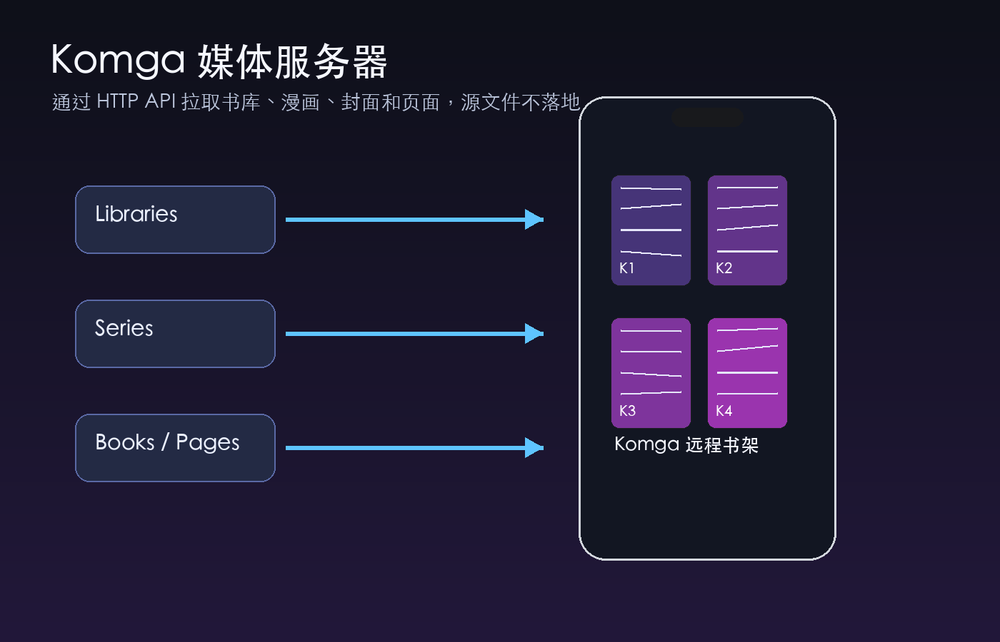

Komga 设置页支持服务器地址、API Key 和显示名称。测试连接时会真实请求 API，并打印 HTTP 状态、响应内容摘要、书库数量和同步结果。API Key 保存到 Keychain，不明文写入 JSON 或 UserDefaults。同步结果会转换成 App 内部统一的 `ComicBook` 模型，UI 不直接依赖 Komga 原始 JSON。

远程阅读时，阅读器不直接调用 Komga API，而是通过 `RemotePageLoader` 与缓存层分发页面请求。当前页优先加载，前后页面按小窗口预取；内存缓存保存少量已解码图片，磁盘缓存保存远程图片 Data，并按容量限制清理。这样可以减少每次翻页都等待网络的情况，同时避免一次下载整本漫画导致内存暴涨。

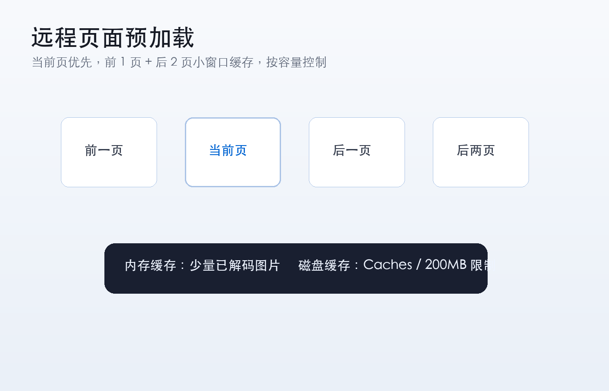

## OCR 与 AI 翻译

MReader 的 OCR 不是直接把阅读器缩略图扔给 Vision。进入 OCR 或 AI 翻译流程时，会优先使用原图或 OCR 专用高分辨率解码图。长条漫画会按高度切片，每个切片保留重叠区域，再分别做 OCR。预处理包含灰度化、对比度增强、锐化、降噪、反色处理和放大。对同一块区域会尝试原图、增强图和反色图，再根据置信度与文本合理性合并。

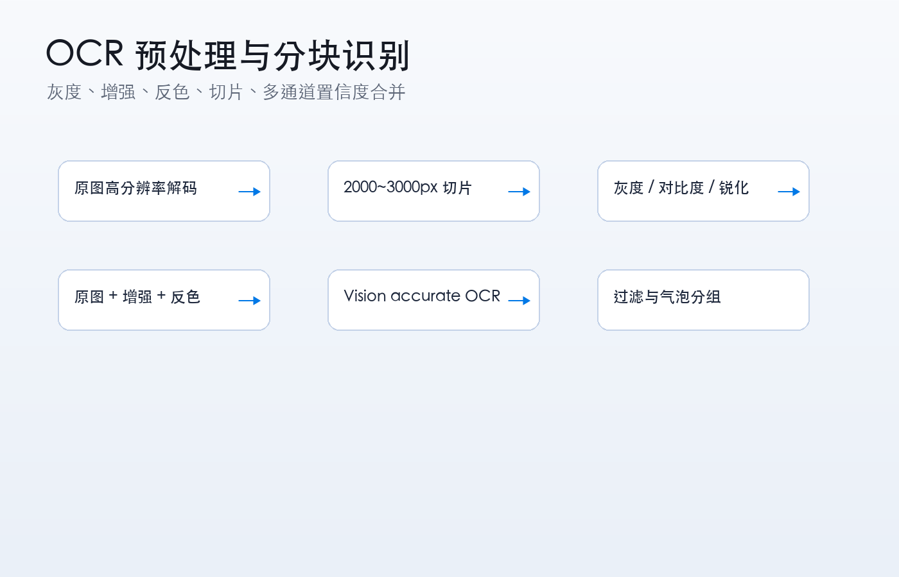

OCR 结果会经过安全区与小字过滤。页边的网址、水印、广告、版权标识和过小文字可以不送去放大或翻译，减少漫画正文以外的噪音。用户可以在设置里调整忽略字体大小，并通过 OCR 调试模式查看识别框、文本、confidence 和过滤原因。

AI 翻译发送给大模型前会套用统一 Prompt 模板，目标是准确翻译漫画对白，保留语气、称呼、人物关系、情绪和口语感，不续写、不总结、不评价、不推断用户身份。如果 OCR 内容包含成人、暴力或敏感文本，Prompt 要求只做中性、准确翻译，不美化、不扩写、不新增细节。返回结果只显示翻译文本。

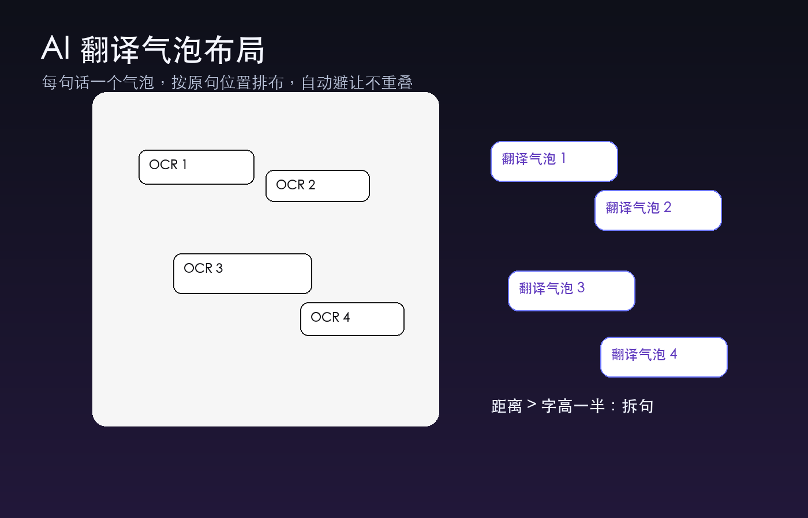

翻译气泡按原句位置显示，并尽量避开重叠。两段 OCR 文字是否合并，不再只看固定距离，而是参考识别字体大小：如果两句话之间的距离超过较小字体高度的一半，就识别为两句话；即使离得很近，只要字体大小差异明显，也会拆成两句。这样可以减少两个相邻对白被黏成一句的问题。五彩翻译字体降低了亮色比例，避免过亮文字影响阅读。

当 OCR 或视觉模型提供 `bubbleBox` 时，分组会先用 `visualBubbleBoxesAreCompatible` 做宽松的“明确不同”否决，再用 `sameVisualBubbleIdentity` 严格确认是否真的是同一个气泡。后者综合高 IoU、中心距离、宽高比、面积比和小容差内的 mutual containment；IoU 超过 0.18 只代表两个框没有明显冲突，不能直接代表同一身份。无法确认身份时仍回到原有的字号、颜色、行距和文字位置启发式，避免把相邻说话人的对白合成一个翻译单元。

翻译结果始终带有用于遮挡原文的背景承载层：可靠气泡使用 `detectedBubble`，沿用真实气泡范围；缺少可靠气泡或检测框病态时使用 `syntheticBubble`，背景尺寸由译文实际测量结果决定，不继承整页、超宽或超高的 OCR 框。

## 导入方式

本地导入会复制到用户选择的 Files 漫画根目录，而不是复制到 App 私有沙盒。用户可以导入单个文件，也可以选择文件夹。MReader 会在目标目录内保持漫画文件可见，让用户以后可以直接用文件 App 复制、移动、删除或备份。

MReader 还包含局域网页导入服务。用户在同一网络下通过浏览器打开 App 提供的地址，可以上传 ZIP、PDF 等漫画文件。网页上传采用流式写入临时文件的方式，避免大文件上传时在内存中堆出多个完整副本。服务启动时会清理上一次异常断开后残留的临时 `.body` 文件，降低磁盘膨胀风险。

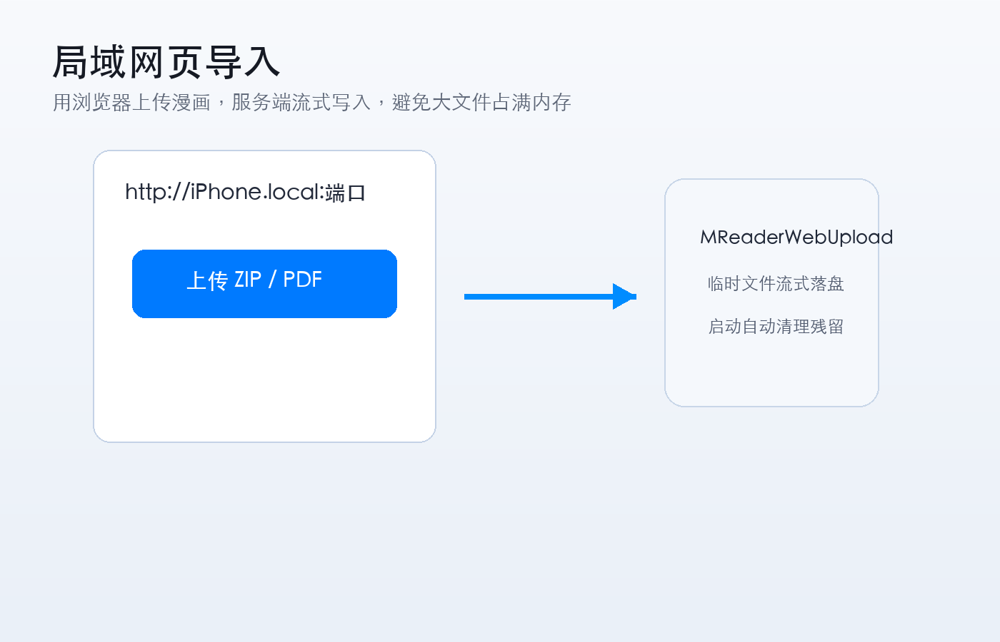

## 触感反馈

触感反馈由统一的 `HapticManager` 管理，而不是散落在各个 View 中。设置里可以打开或关闭触感反馈。轻触感用于按钮、Tab、菜单；中等触感用于翻页、长按、切换阅读模式；重触感用于删除确认、批量操作和错误提示；成功、失败、警告分别用于导入完成、扫描完成、连接失败等状态反馈。

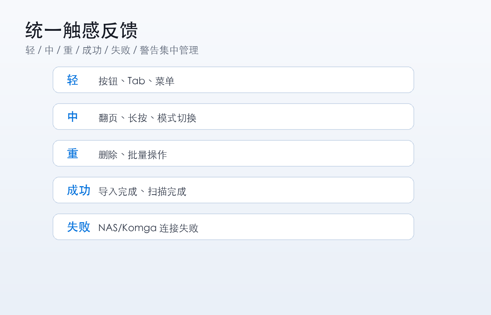

阅读器不会过度震动。连续滚动模式下不会每滚动一页都震，只在章节切换、边界、长按菜单、翻页等关键动作给反馈。iPad 或不支持触感的设备会自动降级，不会报错。

## 架构说明

MReader 第一版的架构分为几个层次：

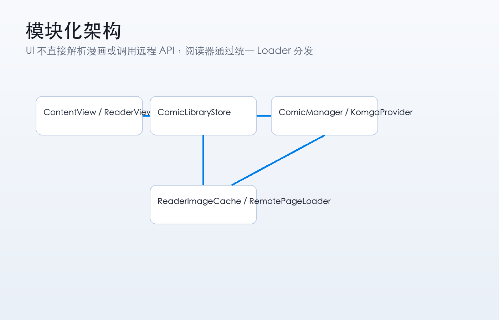

`ContentView` 负责书架、设置、导入、选择模式和页面导航。`ReaderView` 负责阅读器交互、翻页、滚动、工具栏、AI 按钮、OCR 覆盖层与翻译显示。UI 层不直接解析漫画压缩包，也不直接调用 Komga API。

`ComicLibraryStore` 是书架状态中心，持有 `comics` 与 `series`，负责合并本地扫描结果和 Komga 同步结果。它会保留已有漫画的阅读进度、锁定状态、OCR/AI 设置、阅读模式与最近阅读时间，避免每次扫描覆盖用户状态。磁盘 JSON 读写放到后台 actor 中执行，降低主线程卡顿风险。

`ComicManager` 负责本地 Files 漫画库：根目录 bookmark、扫描、导入、封面生成、ZIP/CBZ/PDF/EPUB 页面列表、本地删除、缩略图重建等。它不负责远程媒体库。

`KomgaAPIClient`、`KomgaProvider` 和 `KomgaModels` 组成远程媒体库接入层。API Client 只负责 HTTP 请求和 JSON 解析，Provider 负责把 Komga 原始模型转换成 App 内部统一模型。API Key 保存到 Keychain。

`ReaderImageCache`、`RemotePageLoader` 和相关缓存逻辑负责页面加载。Reader 根据 `ComicBook.sourceType` 分发：本地漫画走文件或压缩包读取，Komga 漫画走远程页面加载。OCR 和 AI 翻译统一基于 `UIImage` / `Data`，因此本地页和远程页可以走同一套流程。

`OCRPreprocessor` 与 `AITranslator` 负责文字识别、预处理、过滤、分组和翻译 Prompt。这样后续如果要增加视觉模型识别、其他 OCR 引擎、批量翻译缓存或云端翻译 Provider，不需要重写阅读器 UI。

## 编译与运行

项目是 SwiftUI iOS App，使用 Xcode 打开：

```bash
open mreader.xcodeproj
```

当前依赖包括：

- ZIPFoundation：ZIP/CBZ 读取。
- Apple Vision：本地 OCR。
- CoreImage / ImageIO：OCR 预处理与高分辨率解码。
- PDFKit / UIKit / SwiftUI：PDF 渲染与阅读界面。

命令行构建示例：

```bash
xcodebuild \
  -project mreader.xcodeproj \
  -scheme mreader \
  -destination 'generic/platform=iOS' \
  -disableAutomaticPackageResolution \
  -onlyUsePackageVersionsFromResolvedFile \
  ONLY_ACTIVE_ARCH=YES \
  build
```

## 当前第一版能力清单

- 用户选择 Files 中的本地漫画根目录。
- 本地漫画源文件保持用户可见，不写入 App 私有漫画库。
- 书架两栏封面网格、固定封面框、进度条、页数、文件大小。
- 系列文件夹作为书架二级层级。
- 漫画和系列长按管理。
- 导入文件、导入文件夹、网页上传。
- 启动维护和下拉刷新扫描本地库。
- Komga 服务器配置、测试连接、同步书架、远程阅读。
- 水平翻页、垂直翻页、连续滚动、无限滚动、双页模式。
- 每本漫画独立阅读设置和进度。
- OCR 放大、OCR 调试框、安全区、小字过滤。
- OpenAI 兼容接口 AI 翻译，支持自定义 Prompt。
- 翻译气泡避让、边缘流光反馈、长按翻译。
- 全局触感反馈系统。
- 缩略图缓存、远程页面缓存、阅读进度持久化。

## 后续方向

第一版的重点是“能稳定作为个人漫画阅读器使用”。后续可以继续增强：

- 如果后续确实需要更多压缩格式，再单独评估 7z、RAR、CBR 的稳定解压库和内存策略。
- 增加更细的远程媒体库冲突策略。
- 增加离线缓存策略，但仍不改变本地库原则。
- 增加更完整的视觉模型 OCR/翻译模式。
- 增加主题、阅读统计、批量元数据整理。
- 增加更多可视化调试工具，帮助定位 OCR、页面加载和滚动进度问题。

MReader 的核心原则会保持不变：漫画文件属于用户，阅读体验优先，AI 是辅助，功能入口清晰，底层逻辑不要和 UI 混在一起。
